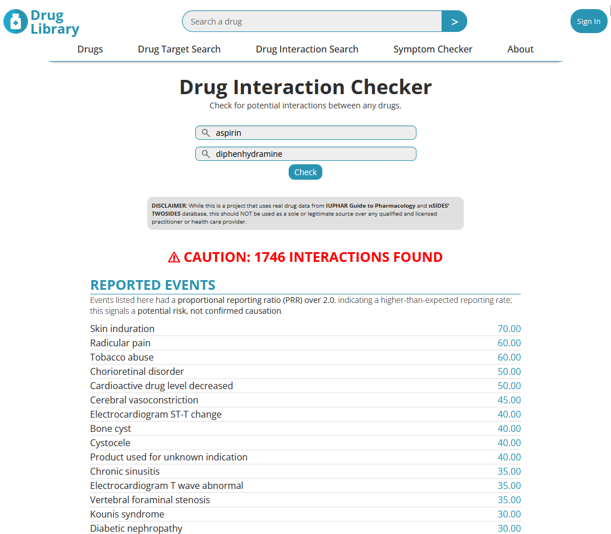

# Drug Library (Frontend)

  
   
  <em>View potential interactions and reported adverse events instantly.</em>

**Drug Library** is a responsive **React + Vite web application** for exploring drugs, identifying potential drug-drug interactions (DDIs), and reviewing shared receptor targets. The site integrates with a **FastAPI backend** that processes multi-million row pharmacological and FDA datasets, enabling accurate and scalable results across thousands of drugs and reported adverse events. The **API** can be found [here](https://github.com/imtimtam/ddi-api).

## Demo Features
- **Drug Interaction Search**: Enter two drugs to check for potential interactions from a backend API.

  
   
  <em>Mobile-friendly with clear and reliable results when no adverse events are found.</em>

- **Autocomplete Suggestions**: React-powered suggestions help users quickly find drugs from thousands of options.
- **Dynamic Results**: Interaction results update instantly without page reloads using React state and hooks.
- **Drug Target Search**: Explore drug targets (planned).
- **Symptom Checker**: Explore drug-related symptoms and potential causes (planned).

## Design Features
- **Interactive React Components**: Autocomplete, dynamic search, and results rendering without page reloads.
- **Component-based UI**: Built with reusable React components like `InteractionForm`, `Results`, and `InteractionPage`.
- **State Management**: Uses `useState` and `useEffect` for managing user input and API responses.
- **Responsive Frontend**: Works seamlessly across desktop, tablet, and mobile devices.
- **Modular CSS**: Styles organized into reusable components for maintainability.
- **CSS Variables**: Centralized control of colors, fonts, and backgrounds for theme consistency.
- **BEM Methodology**: Predictable and clear class naming for CSS.
- **Flexbox Layouts**: Ensures balanced and adaptive alignment across devices.
- **Minimalist Header & Navigation**: Clean design with hover and active states.
- **Google Fonts Integration**: `Open Sans` used for modern, readable typography.

## Technologies
- React 18
- Vite
- HTML5
- CSS3
- JavaScript (ES6+)
- Google Fonts: `Open Sans`

## Component Architecture

- **InteractionPage**: Page container for the interaction checker.
- **InteractionForm**: Handles user input, suggestions, and submits queries.
- **Results**: Displays interaction results returned from the API.

## Getting Started

**Prerequisites**

- A modern web browser (Chrome, Firefox, etc.)
- Node.js >= 18
- npm >= 9
- Backend API running locally, found [here](https://github.com/imtimtam/ddi-api).

**1. Clone and move to the repository**

    git clone https://github.com/imtimtam/ddi-web

**2. Install dependencies**
 
    npm install

**3. Run the server**

    npm run dev

## Roadmap
- Improve responsive design and add potential animations.

## License

This project is licensed under the MIT License.

## Credits

- **Icons and Images** – Pixabay (free under [Pixabay License](https://pixabay.com/service/license/))

- **Guide to Pharmacology** – [https://www.guidetopharmacology.org](https://www.guidetopharmacology.org)  
  Provides information about drug targets and ligand interactions.

- **TWOSIDES Dataset** – [https://www.nsides.io](https://nsides.io/)  
  Contains drug-drug interactions and associated adverse event data.